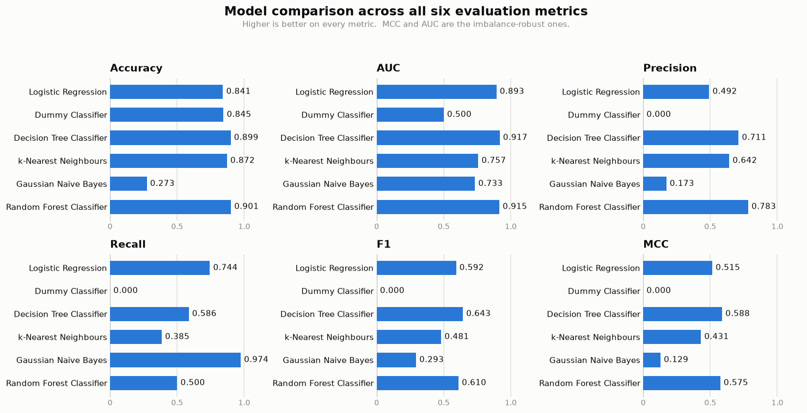
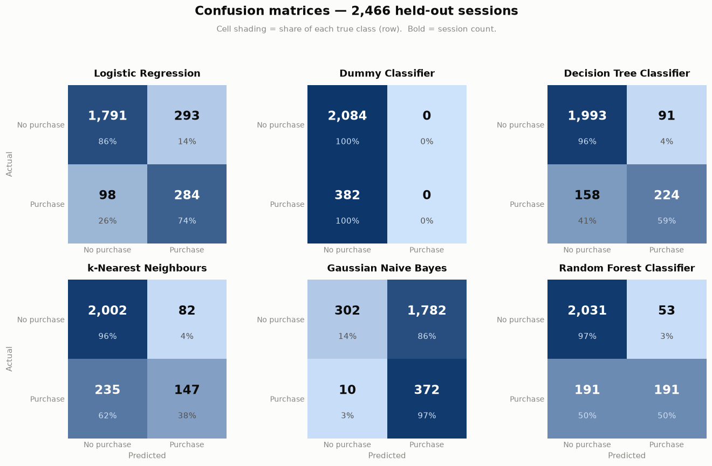

# Online Shoppers Purchasing Intention — Classification

Predicting whether an e-commerce browsing session ends in a purchase, using six
classifiers compared across six metrics.

**Anamaya Vyas** · BITS ID 2025AC05082
M.Tech (AIML / DSE) — Machine Learning, Assignment 2

| | |
|---|---|
| **GitHub repository** | https://github.com/anamayavyas05-AIDDev/Streamlit-app-for-model-comparision |
| **Live Streamlit app** | https://app-for-model-comparision-48b4q5megqxzladwkvcu8q.streamlit.app/ |

---

## a. Problem Statement

A session on an online store either ends in a purchase or it doesn't, and the
site records a good deal about what happened along the way: which pages were
opened, how long the visitor stayed on them, whether they bounced straight back
out. The question here is whether that behaviour is enough to predict the
purchase.

It is a binary classification problem on tabular data. I chose it for two
reasons. Retailers genuinely care about the answer, since spotting a likely
buyer while they are still browsing is worth money. And only about 15% of
sessions end in a sale, so the imbalance forces you to think about which metric
you actually trust. That second part is what made the dataset interesting to
work with.

---

## b. Dataset Description

| | |
|---|---|
| **Source** | UCI Machine Learning Repository — *Online Shoppers Purchasing Intention Dataset* (CC BY 4.0) |
| **Instances** | 12,330 browsing sessions |
| **Features** | 17 (10 numeric, 6 categorical, 1 boolean) |
| **Target** | `Revenue` — `True` if the session ended in a purchase |
| **Class balance** | 84.53% no purchase / 15.47% purchase |
| **Missing values** | None |
| **Duplicate rows** | 125 duplicated, 201 rows once every copy is counted; kept |

Both minimums set by the assignment are met: 17 features against a minimum of
12, and 12,330 rows against a minimum of 500.

**Feature groups**

- **Behaviour** — how many Administrative, Informational and ProductRelated
  pages were opened, and the time spent on each group.
- **Engagement** — `BounceRates`, `ExitRates`, `PageValues`.
- **Timing** — `Month`, `SpecialDay`, `Weekend`.
- **Visitor** — `OperatingSystems`, `Browser`, `Region`, `TrafficType`,
  `VisitorType`.

Four columns are stored as integers but are not quantities.
`OperatingSystems`, `Browser`, `Region` and `TrafficType` are category codes,
and browser 3 is not one more than browser 2, so I one-hot encoded them rather
than scaling them.

I looked at the duplicates before deciding what to do with them. All 201 rows
turn out to be the same kind of session: one product page opened (189 of them)
or two, zero seconds recorded on the page, bounce rate and exit rate both
exactly 0.2, and not a single purchase anywhere in the group. That is a real
browsing pattern rather than a data error, someone landing and leaving
immediately, so dropping it would throw away a genuine signal about bounced
visits. It is under 2% of the data and I kept it.

**Signal check.** Before fitting anything I compared the averages of a few
features across the two outcomes.

| Feature | Did not buy | Bought |
|---|---:|---:|
| PageValues | 1.98 | 27.26 |
| ExitRates | 0.047 | 0.020 |
| ProductRelated | 28.7 | 48.2 |
| BounceRates | 0.025 | 0.005 |

`PageValues` is the standout: buyers average roughly fourteen times higher. The
other three all move the way you would expect, so there is something in the data
to learn from.

---

## c. GitHub Repository Link

https://github.com/anamayavyas05-AIDDev/Streamlit-app-for-model-comparision

The repository holds the source code, `requirements.txt`, this `README.md`, the
training notebook, the held-out test data (`test_data.csv`) and a `model/`
folder with all six saved pipelines.

### Methodology

I split the data 80/20 with `stratify=y`, which keeps the buyer rate almost
identical in both halves (15.47% in train, 15.49% in test), and used
`random_state=42` everywhere so the numbers reproduce. That leaves 9,864 rows
for training and 2,466 for testing.

All the preprocessing sits in one `ColumnTransformer`: `StandardScaler` for the
numeric columns, `OneHotEncoder` with `handle_unknown="ignore"` for the
categorical ones, and passthrough for `Weekend`, which is already 0/1. That
turns 17 columns into 74.

The part that matters is where the preprocessor lives. It goes inside each
`Pipeline` rather than being fitted once on the whole dataset. Scaling
everything up front would let the test rows contribute to the mean and standard
deviation that training sees, and every score below would come out flattered.
Since all six models get the identical preprocessor, the gaps between them come
from the algorithms and not from how the data was prepared.

---

## d. Models Used

The five required classifiers, plus a `DummyClassifier` that ignores every
feature and always answers "no purchase". I added the dummy because on data this
imbalanced an accuracy score means very little until you know what doing nothing
scores.

All figures below are on the held-out test set (`test_data.csv`), 2,466 sessions
the models never saw during training.

| ML Model Name | Accuracy | AUC | Precision | Recall | F1 | MCC |
|---|---:|---:|---:|---:|---:|---:|
| Logistic Regression (`class_weight="balanced"`) | 0.8414 | 0.8931 | 0.4922 | **0.7435** | 0.5923 | 0.5152 |
| Decision Tree (`max_depth=5`) | 0.8990 | **0.9172** | 0.7111 | 0.5864 | **0.6428** | **0.5883** |
| kNN (`n_neighbors=5`) | 0.8715 | 0.7572 | 0.6419 | 0.3848 | 0.4812 | 0.4307 |
| Gaussian Naive Bayes | 0.2733 | 0.7330 | 0.1727 | **0.9738** | 0.2934 | 0.1292 |
| Random Forest (Ensemble, 100 trees) | **0.9011** | 0.9146 | **0.7828** | 0.5000 | 0.6102 | 0.5751 |
| Dummy Classifier (baseline) | 0.8451 | 0.5000 | 0.0000 | 0.0000 | 0.0000 | 0.0000 |



### Observations

| ML Model Name | Observation about model performance |
|---|---|
| **Logistic Regression** | Ranks well, decides badly. Its AUC of 0.8931 means it orders buyers above non-buyers about as well as anything else here, but my first run used the default settings and recall came out at 0.3586, missing nearly two thirds of the buyers. Setting `class_weight="balanced"` lifted recall to 0.7435 and cost precision, which dropped from 0.7405 to 0.4922. I kept the balanced version. Its accuracy of 0.8414 sits just below the dummy's 0.8451, which is the clearest illustration in this table of how little accuracy tells you on its own. |
| **Decision Tree** | Best model here, with the top MCC, F1 and AUC. It picks up combinations a linear model cannot express, such as high `PageValues` together with a low exit rate. The `max_depth=5` limit is doing real work: left unrestricted the tree grows to depth 25 and AUC falls to 0.7435, because the leaves end up pure and `predict_proba` then returns little more than 0 or 1, leaving nothing to rank by. |
| **kNN** | The weakest of the genuine models, especially on AUC (0.7572). One-hot encoding leaves 74 mostly sparse columns, and Euclidean distance means less the more dimensions you add. Imbalance compounds it, since a buyer's five nearest neighbours are usually non-buyers, which is why recall is only 0.3848. |
| **Naive Bayes** | The interesting failure. Accuracy of 0.2733 is far below the dummy, yet its recall of 0.9738 is the highest of any model, because it labels almost everything a purchase. It catches nearly every real buyer and drags in a flood of false positives with them, leaving precision at 0.1727. Both of its assumptions break on this data: `ProductRelated` and `ProductRelated_Duration` are plainly not independent given the class, and the numeric columns are nowhere near Gaussian, being heavily skewed and full of zeros. MCC of 0.1292 is the honest summary. |
| **Random Forest (Ensemble)** | Highest accuracy at 0.9011 and much the best precision at 0.7828, so when it does call a purchase it is usually right. Averaging 100 decorrelated trees cuts the variance of any single one. I left it on default settings with no class weighting, though, and it stays cautious about the minority class: recall of 0.5000 means half the buyers still slip past. It does not beat the depth-5 tree on MCC or F1, which suggests the depth limit was already providing the regularisation the ensemble would otherwise contribute. |
| **Dummy Classifier** | Answers "no purchase" every time and still scores 84.51% accuracy, purely because that is how the classes divide. Precision, recall and F1 are all zero, AUC is exactly 0.5000 and MCC exactly 0.0000. A useful floor, not a model. |
| **Overall Winner for this dataset** | **Decision Tree (`max_depth=5`).** It takes the three metrics that survive class imbalance: MCC 0.5883, F1 0.6428 and AUC 0.9172. Random Forest wins accuracy and precision, and if acting on a wrong prediction were expensive I would pick it instead. But with 84.53% of sessions in one class, accuracy is the weakest evidence on the table, and missing half the buyers is a real cost. The tree is also the model I can open up and explain to someone who does not care how it was fitted. |

### Why accuracy alone is misleading here

The dummy and Naive Bayes fail in opposite directions, which is what makes them
worth putting side by side:

| Model | Accuracy | Recall | MCC |
|---|---:|---:|---:|
| Dummy Classifier | 0.8451 | 0.0000 | 0.0000 |
| Gaussian Naive Bayes | 0.2733 | 0.9738 | 0.1292 |

One never predicts a purchase, the other predicts almost nothing else. Judged on
accuracy the dummy looks three times better; judged on recall the order flips
completely. Neither is usable, and MCC is the only metric in the set that says
so about both, because it uses all four cells of the confusion matrix instead of
a single row or column.

That is the argument for reporting all six metrics rather than leaning on any
one of them, and it is sharpest on a dataset as imbalanced as this one.



---

## Streamlit Application

Live app: https://app-for-model-comparision-48b4q5megqxzladwkvcu8q.streamlit.app/

All four required features are in the deployed app:

1. **Dataset upload (CSV)** — a file uploader for the held-out test data, with
   checks for files that will not parse, files with no rows, and files missing
   columns the model needs.
2. **Model selection dropdown** — all six models, with the list read from
   `model/results.csv` so the app cannot drift out of step with what was
   actually trained.
3. **Evaluation metrics** — Accuracy, AUC, Precision, Recall, F1 and MCC,
   computed live on whatever was uploaded, for the selected model.
4. **Confusion matrix and classification report** — shown side by side, with
   each cell of the matrix giving both the count and its share of the true
   class.

Each `.pkl` holds a whole pipeline, scaler and encoder included, so the app
loads one and calls `predict()` straight away and the preprocessing replays
exactly as it did in training. Nothing is ever retrained in the app.

**Using it:** open the app, pick a model in the sidebar, upload `test_data.csv`
from this repository. Any CSV with the same 17 feature columns works. If there
is no `Revenue` column the app says so and falls back to showing predictions,
since there is nothing to score against.

---

## Repository Structure

```
project-folder/
├── app.py                          # Streamlit application
├── Model_Training.ipynb            # training, evaluation and model export
├── requirements.txt
├── README.md
├── test_data.csv                   # held-out 20% test split (2,466 rows)
├── online_shoppers_intention.csv   # full source dataset
├── model_comparison.png
├── confusion_matrices.png
└── model/
    ├── Model_Training.ipynb        # copy, so model/ holds the code with the models
    ├── results.csv                 # metrics table driving the app
    ├── dataset_info.md             # dataset panel shown inside the app
    ├── logistic_regression.pkl
    ├── decision_tree_classifier.pkl
    ├── k-nearest_neighbours.pkl
    ├── gaussian_naive_bayes.pkl
    ├── random_forest_classifier.pkl
    └── dummy_classifier.pkl
```

---

## Running Locally

```bash
python3 -m venv .venv
source .venv/bin/activate
pip install -r requirements.txt
streamlit run app.py
```

Then upload `test_data.csv` when the browser opens. Running
`Model_Training.ipynb` from top to bottom rebuilds everything: the six
pipelines, `results.csv`, the test split and both figures.

The notebook appears twice on purpose. `model/` carries a copy so the folder
holds the saved models together with the code that produced them, matching the
structure the assignment asks for. Run the copy at the repository root — its
paths are relative to the root, writing the pipelines into `model/` and the test
split and figures beside itself.

**Environment:** Python 3.12.10, scikit-learn 1.9.0, pandas 3.0.5, numpy 2.5.2,
Streamlit 1.61.1, matplotlib 3.11.1. Everything reproduces with
`random_state=42`.
